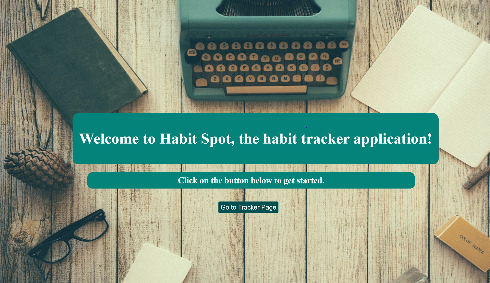

# Habit-Spot-Capstone

[](https://www.javascript.com/)
[](https://opensource.org/licenses/MIT)
[](https://github.com/JoyUmoekpo/Habit-Tracker-Journal-Foundations-Capstone/commit/main)

## Description
Welcome to Habit Spot!

Habits can be hard to keep. So, I created HabitSpot as a solution to help users better track and journal about their progress with their chosen habits.

I was motivated to create HabitSpot because maintaining personal habits is important to me and I enjoy journaling to process my thoughts. For that reason, I combined these two things to form Habit Spot.

## Table of Contents
* [Technologies Used](#technologies-used)
* [Respoitory Link](#repository-link)
* [Features](#features)
* [Future Developments](#future-developments)
* [Application Images](#application-images)
* [Contributing](#contributing)
* [Tests](#tests)
* [Questions](#questions)
* [Credits](#credits)
* [License](#license)

## Technologies Used
* HTML
* CSS
* Vanilla JavaScript
* Unsplash
* Node.js
* Express
* Axios
* Cors
* JSON

## Repository Link
* This is the repository link for this application: [Habit Spot Repository](https://github.com/JoyUmoekpo/Habit-Tracker-Journal-Foundations-Capstone)

## Features
* Users can add habits to the tracker page
* Users can images to their habits
* Users can delete habits
* Users can update the day counter for their habits
* Users can add a journal entry on the journal page
* Users can change their background theme

## Future Developments
* A calendar where users can place their habit journal entries
* Icons on journal entries to track their mood for that entries
* Weather API implementation
* A graph to show the progression of their mood over time based on the mood icons
* A To-Do list
* Unit testing

## Application Image(s)



## Contributing
* I'm open to contributions!

## Tests
* No tests were preformed.

## Questions
If you have any questions, feel free to contact me by using the information listed below:

* Github: https://github.com/joyumoekpo
* LinkedIn: https://www.linkedin.com/in/joyumoekpo/

## Credits
* Unsplash / Favicon: https://unsplash.com/photos/pTb54lkyuNQ

## License
### Unsplash License

```
Unsplash photos are made to be used freely. Our license reflects that.

All photos can be downloaded and used for free
Commercial and non-commercial purposes
No permission needed (though attribution is appreciated!)
```
